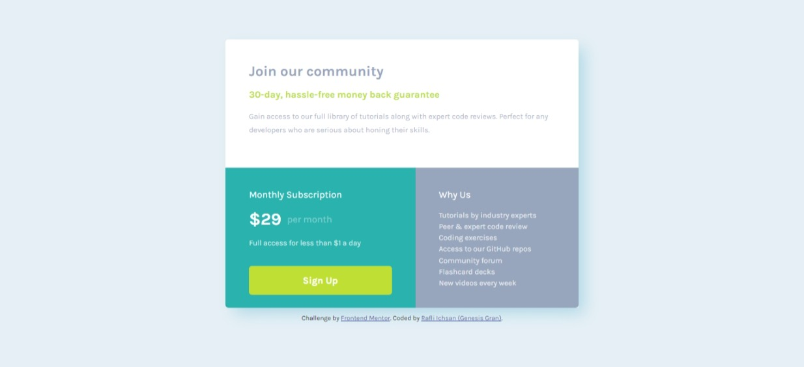

# Frontend Mentor - Single price grid component solution

This is a solution to the [Single price grid component challenge on Frontend Mentor](https://www.frontendmentor.io/challenges/single-price-grid-component-5ce41129d0ff452fec5abbbc). Frontend Mentor challenges help you improve your coding skills by building realistic projects.

## Table of contents

- [Welcome!](#welcome!)
- [The challenge](#the-challenge)
- [Screenshot](#screenshot)
- [Links](#links)
- [Built with](#built-with)
- [Author](#author)

## Welcome!

Hello there! This is my solution to the [Single price grid component challenge on Frontend Mentor](https://www.frontendmentor.io/challenges/single-price-grid-component-5ce41129d0ff452fec5abbbc). Feel free to give any suggestion or pointing out anything i miss.

## The challenge

Users should be able to:

- View the optimal layout for the component depending on their device's screen size
- See a hover state on desktop for the Sign Up call-to-action

## Screenshot

## Links

- Solution URL: [https://www.frontendmentor.io/solutions/single-price-grid-using-html-css-grid-flexbox-and-media-query-EN61jalY-]
- Live Site URL: [https://genesisgran.github.io/single-price-grid/]

## Built with

- Semantic HTML5 markup
- CSS custom properties
- Grid
- Flexbox
- Media Query

## Author

- Frontend Mentor - [@GenesisGran](https://www.frontendmentor.io/profile/GenesisGran)
- Discord - Genesis Gran#9500
